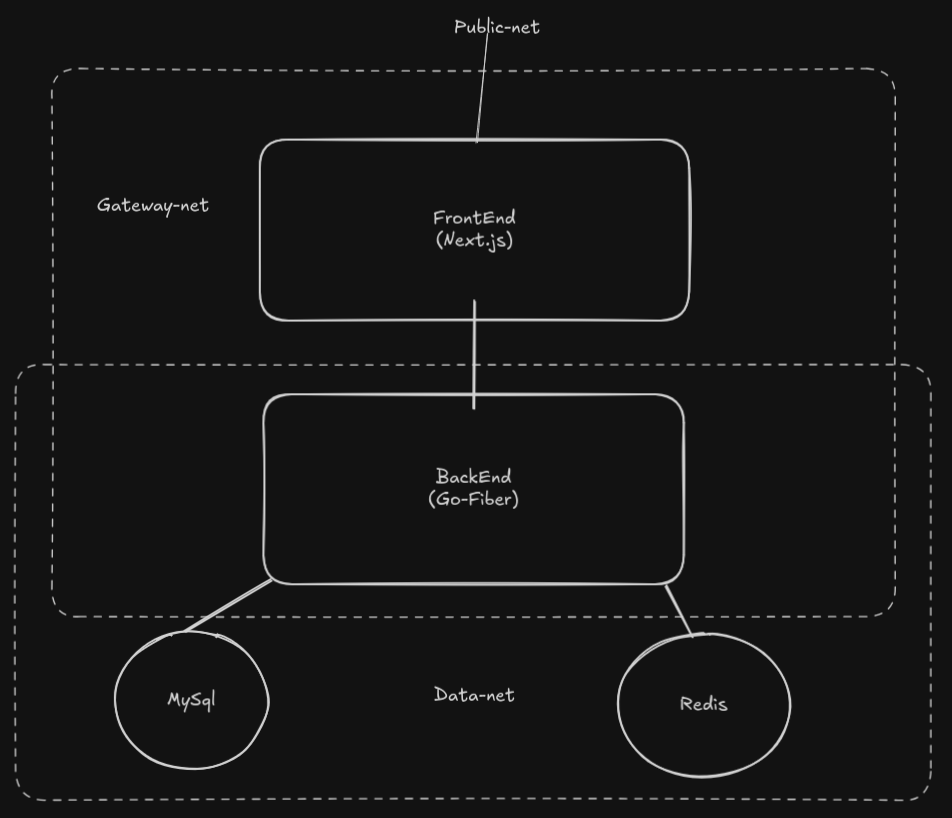

# PcPologist - Tech Content API

## Overview
A Fiber-based REST API for a technology content platform delivering articles, tutorials, and educational resources about programming, operating systems, AI, and career topics.

**RUN**

`docker-compose build`

`docker-compose up -d`

`docker-compose logs -f`

## Tech Stack
- **Framework**: GoFiber v2
- **Database**: MySQL , Redis
- **ORM**: sqlx
- **JSON Processing**: Sonic (bytedance)
- **Next.js** (App Router)
- **TypeScript**
- **Tailwind CSS**
- **Axios** or similar HTTP client

## Project Structure


## Key Features
- Topic-based content organization
- Two-level category system (first/second category)
- Article grouping under topics
- Sliders for content discovery:
  - Newest topics
  - Operating Systems
  - Programming Languages
  - Job Positions
  - AI topics
- Search functionality (title + categories)
- Pagination (12 items per page)
- Rate limiting (80 req/min per IP)

## API Endpoints (All GET)

### Sliders
| Endpoint | Description |
|----------|-------------|
| `/api/slider/newest` | Latest 10 topics |
| `/api/slider/system` | Operating systems topics |
| `/api/slider/language` | Programming languages topics |
| `/api/slider/job` | Job positions topics |
| `/api/slider/ai` | AI topics |

### Topics
| Endpoint | Description |
|----------|-------------|
| `/api/topic/by-topic/:name?page=N` | Topics by category name |
| `/api/topic/search-topic/:name?page=N` | Search topics (title + categories) |
| `/api/topic/newest?page=N` | Newest topics (paginated) |

### Articles
| Endpoint | Description |
|----------|-------------|
| `/api/article/get/:topicID` | Full article by topic ID |

## Response Examples

### Slider Response
```json
[
    {
        "id": 1,
        "title": "Understanding Go Routines",
        "imag_url": "https://example.com/image.jpg"
    }
]